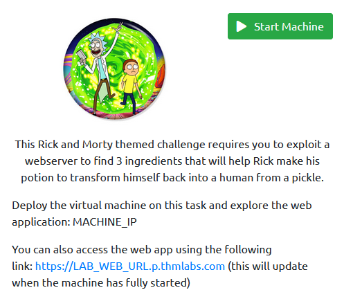
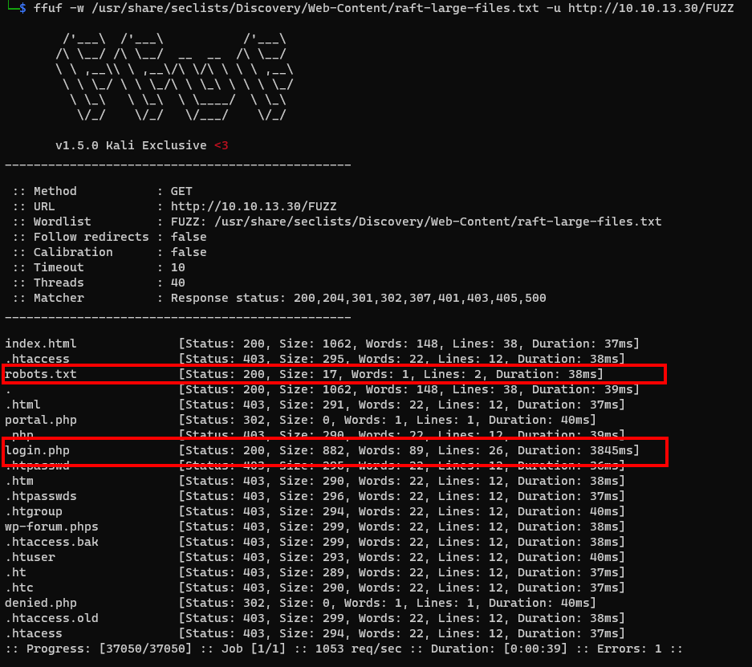
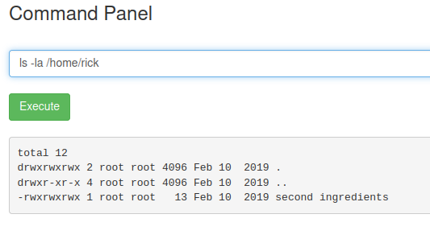
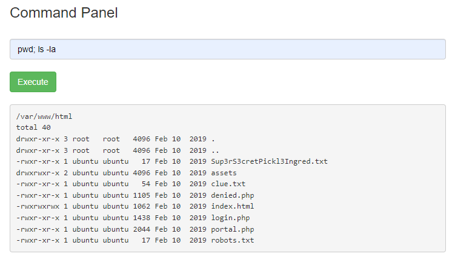
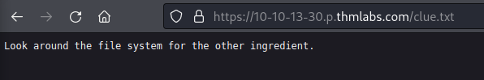
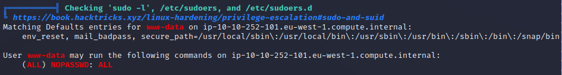
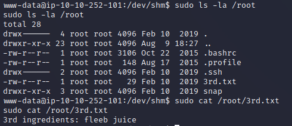

# 🧠 TryHackMe - Pickle Rick (Walkthrough)


Yo! Welcome to the lab write-up for **Pickle Rick** — a Rick & Morty-themed hacking challenge on TryHackMe. This one’s light but lit — perfect to warm up your recon + command injection skills.

> 🧪 Lab Link: [tryhackme.com/room/picklerick](https://tryhackme.com/room/picklerick)  
> 🆓 Room Type: Free | 🧩 Difficulty: Easy

---

## 🌀 About the Room



Goal? Help Rick turn back into a human by finding 3 ingredients hidden inside a webserver. Let’s dive into it 🏄‍♂️

---

## 🔎 Recon Mode: Nmap FTW

Started with some basic scanning:

```bash
nmap -sC -sV -Pn -T4 -oA nmap 10.10.13.30
```

### Findings:
- `22/tcp`: OpenSSH (ignore it for now)
- `80/tcp`: Web server — let’s go web hacking.

---

## 🌐 Web Exploration Begins...

Cracked open the browser, peeked into the source and found some juicy hints 👀

### Then hit it with `ffuf` for hidden content:

```bash
ffuf -w /usr/share/seclists/Discovery/Web-Content/raft-large-files.txt -u http://10.10.13.30/FUZZ
```



🔥 Found:
- `robots.txt`
- `login.php`

Time to investigate…

---

## 🔓 Login Access

From robots.txt and HTML comments, grabbed a username and something that looked like a password.

🧪 Tried creds:
```
Username: R1ckRul3s
Password: Wubbalubbadubdub
```

Success! Logged into the admin panel 🧼

---

## 🧨 Command Injection

Inside the “command panel” — found a field to run system commands! Jackpot 💥

Example:

```bash
ls -la /home/rick
```



And yup, saw a file named `second ingredients`.

---

## 📁 More Enumeration

Listing the full `/var/www/html`:

```bash
pwd; ls -la
```



Found another ingredient file:  
`Sup3rS3cretPickl3Ingred.txt` in the web root.

---

## 🧩 Got a Clue...

Visited `clue.txt` in browser. Got this hint:



```
Look around the file system for the other ingredient.
```

So we did just that...

---

## 🚪 Privilege Escalation

Time to root this thing. Checked what `www-data` can do:

```bash
sudo -l
```

### Output:



👀 Yo — `NOPASSWD: ALL` as www-data? That’s literally root access. Instant win.

---

## 🧃 Final Flag

Dropped this command:

```bash
sudo cat /root/3rd.txt
```

Got:



```
3rd ingredients: fleeb juice
```

Room done ✅

---

## 🧠 Summary

This lab gave solid practice in:
- Web enumeration
- Finding hidden files
- Basic command injection
- Escalating with misconfigured sudo rights

---

## ✍️ Author: Hecker

*“From Pickle to Pwned” – stay rooted, stay hacking 🧠💻*
